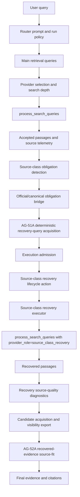
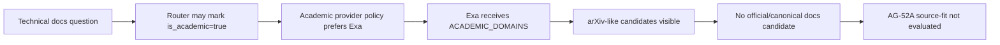

# AG-51B Source Acquisition Architecture Review

## 1. Phase Purpose

AG-51B is an architecture/design autopsy for the source-trust corridor. The
phase asks why the already-admitted official/current/canonical recovery path
keeps producing visible recovered candidates and final citations from arXiv
instead of an official/current/canonical source such as PostgreSQL
documentation.

This phase does not repair behavior. It maps the acquisition path, inspects
stable repo artifacts and scoped local output-quality packets, evaluates the
licensed architecture options, and recommends exactly one next licensed
surface.

The addendum expanded the review to prompt-policy surfaces. Prompt templates,
prompt-adjacent policy code, routing/researcher/recovery prompt builders, and
source-class obligation wording were inspected as architecture inputs. No
prompt rewrites or prompt behavior changes were made.

## 2. Source-Layer Boundary Handling

Referenced Project Source context was provided inline in the phase prompt.
Repo docs guide Codex; inline prompt rules supplied the Project Source context
needed for this phase.

Allowed inputs used:

- repo-tracked files in the local checkout;
- committed validation and architecture docs;
- scoped local output-quality packets explicitly named in the phase prompt;
- verified local git/GitHub state.

Scoped local output-quality packets were available:

- `output/ag50f_output_quality_review_packet.md`
- `output/ag52a_output_quality_review_packet.md`
- `output/ag52b_output_quality_review_packet.md`
- `output/ag51a_output_quality_review_packet.md`

The optional AG-51B local working packet was not created.

No ChatGPT Project Source files were assumed to exist in the repo unless they
were repo-tracked. No raw provider payloads, raw runtime prompts, DB rows,
private logs, caches, secrets, `.env` contents, or full traces were inspected.

## 3. Evidence Summary

### AG-50F

AG-50F established the source-trust failure pattern for the PostgreSQL MVCC
query.

| Field | Observed state |
| --- | --- |
| `recovered_result_count` | `11` |
| `candidate_return_status` | `candidates_returned` |
| `official_canonical_candidate_visible` | `false` |
| `accepted_or_readable_official_or_canonical_count` | `0` |
| `final_evidence_official_or_canonical_count` | `0` |
| `final_citation_official_or_canonical_count` | `0` |
| Final citations | arXiv PDFs |
| Candidate URL/domain visibility | unavailable |

The AG-50F packet also recorded the obvious canonical source landscape:
PostgreSQL's own documentation is the expected official/canonical source class
for PostgreSQL MVCC, snapshots, read/write concurrency, isolation, VACUUM, and
tradeoff claims. The packet could not determine whether PostgreSQL docs were
returned by a provider and later filtered, or never returned.

### AG-52A

AG-52A repaired the evidence-acceptance/source-fit side for already-returned
official/canonical candidates.

Offline, recovered canonical/official candidates could be recognized,
preferred, and preserved into accepted/readable evidence. Live, however, the
candidate set did not exercise that path:

| Field | Observed state |
| --- | --- |
| `recovered_result_count` | `0` |
| `candidate_return_status` | `zero_candidates` |
| `zero_candidate_blocker_kind` | `candidate_visibility_not_exported` |
| `recovered_candidate_source_fit_status` | `not_evaluated` |
| Final citation state | arXiv-only |

AG-52A therefore proved that source-fit was ready if an official/canonical
candidate reached it, but it did not solve acquisition.

### AG-52B

AG-52B repaired candidate/provider visibility enough to distinguish provider
zero from provider-positive/export-visible cases.

The live result showed:

| Field | Observed state |
| --- | --- |
| Provider/candidate counts | visible |
| Existing provider result | candidates returned |
| `recovered_candidate_domain_preview` | `arxiv.org` |
| `official_canonical_candidate_visible` | `false` |
| `recovered_candidate_source_fit_status` | `not_evaluated` |
| Final citations | arXiv-only |

After AG-52B, the failure was no longer "we cannot see candidate counts." It was
"visible accepted recovered candidate domains are still arXiv, not official or
canonical docs."

### AG-51A

AG-51A implemented one generic recovery-only acquisition/search strategy
repair. It changed the deterministic recovery query profile from a weak
canonical-docs variant toward official/reference documentation variants.

Post-AG-51A live fields:

| Field | Observed state |
| --- | --- |
| Recovery query previews | `official documentation PostgreSQL MVCC concurrency tradeoffs`; `reference documentation PostgreSQL MVCC concurrency tradeoffs` |
| `candidate_acquisition_provider_result_count` | `12` |
| `candidate_acquisition_provider_accepted_url_count` | `1` |
| `candidate_acquisition_provider_new_source_count` | `1` |
| `recovered_result_count` | `5` |
| `accepted_url_count` | `1` |
| `recovered_candidate_domain_preview` | `arxiv.org` |
| `candidate_official_or_canonical_count` | `0` |
| `official_canonical_candidate_visible` | `false` |
| `recovered_candidate_source_fit_status` | `not_evaluated` |
| Final citations | arXiv-only |

AG-51A proved that query acquisition can fire and produce better
official/reference documentation query previews while preserving provider,
depth, ranking, evidence acceptance, citation, Author, and final-answer
surfaces. It also proved that this first generic query-profile pass did not
surface an accepted recovered official/canonical candidate.

## 4. Rule 0 Failure Analysis

General failure class:

Existing provider recovery acquisition/search strategy has failed to surface an
official/current/canonical candidate after one generic query-profile repair.

Blast radius:

Source-trust corridor acquisition architecture: existing provider capability,
provider parameters, provider routing/depth policy, source-specific adapters,
new provider evaluation, prompt/query policy, and dogfood-roadmap
prioritization.

Rules that applied in this phase:

- architecture/design only;
- no provider/depth/routing/new-provider/source-specific adapter
  implementation;
- no query-generation, prompt, evidence acceptance, citation, Author, or
  final-answer behavior change;
- no live validation;
- recommend exactly one next licensed surface;
- do not recommend AG-51B implementation unless a concrete non-blind
  existing-provider refinement exists.

Valid mishandles avoided:

- treating another query variant as a concrete refinement;
- moving to citation/Author before official/canonical evidence is visible;
- recommending new provider work without its API/secrets/testing surface;
- recommending adapters without naming maintenance and scope risk;
- broadening provider routing by accident;
- over-indexing on PostgreSQL while preserving the general canonical-docs
  lesson;
- writing a short decision record that would restart the diagnostic loop.

## 5. Current Source-Acquisition Architecture Map



Important ownership boundaries:

- obligation detection decides whether an official/current/canonical source
  class is expected;
- AG-51A query acquisition only appends deterministic recovery queries;
- source-class lifecycle creates one controller-approved action with
  `provider_role=source_class_recovery`;
- the executor reuses the current search depth and last provider list;
- candidate visibility/export consumes sanitized lifecycle/provider facts;
- AG-52A begins only after an official/canonical recovered passage exists.

## 6. Existing Provider/Recovery Capabilities Discovered

The repository has the following provider integrations and adjacent roles.

| Provider/surface | Capability in repo | Source-class recovery use today |
| --- | --- | --- |
| Tavily | `search_depth` `basic`/`advanced`, include/exclude domains, raw content requested | Used only if present in inherited provider list |
| Linkup search | `depth` `fast`/`standard`/`deep`, `outputType=searchResults`, include/exclude domains, date filters | Used only if present in inherited provider list |
| Linkup sourced answer | `outputType=sourcedAnswer`, `depth=deep`, answer endpoint diagnostics | Separate precision block, not wired to source-class recovery |
| Exa | neural search, text requested, include/exclude domains, date filters | Used only if present in inherited provider list; can receive `exa_domain_filter` |
| Brave recon | title/URL/snippet reconnaissance | Not wired to source-class recovery |

The source-class recovery controller has one provider role:
`source_class_recovery`. It does not choose a concrete provider. It records the
current main search depth and allows the executor to call the same search
pipeline with the last main provider list.

The repository already has a domain-constraint seam for some official-source
recovery lanes. `source_class_recovery_official_domains` can be recorded on the
recommendation, copied into action metadata, and merged into `include_domains`
and `exa_domain_filter` by the executor. Today this seam is used for
official/current/legal/current-primary lanes, not for generic canonical
technical documentation such as PostgreSQL docs.

## 7. Existing Provider/Depth/Parameter Inventory

| Layer | Existing parameter | Notes |
| --- | --- | --- |
| Mode policy | Fast=`basic`, Balanced=`basic`, Deep=`advanced` | Passive mode snapshot; no recovery-specific mode |
| Main retrieval depth | `choose_retrieval_search_depth` | High or explicit escalation gives `advanced`; no implicit medium second-pass escalation |
| Source-class recovery depth | inherited `current_search_depth` | No separate recovery-only depth setting |
| Tavily | `search_depth`, `include_domains`, `exclude_domains`, `max_results` | Raw content requested |
| Linkup | `depth`, `outputType`, `includeDomains`, `excludeDomains`, date window | `deep` exists, but source-class recovery uses normal `searchResults` path unless Linkup is already in provider list |
| Exa | `include_domains`, `exclude_domains`, date window | No depth; academic runs can constrain Exa to `ACADEMIC_DOMAINS` |
| Routing | `select_providers` | Academic general queries prefer Exa; high/default general gets Tavily/Linkup/Exa; medium default general skips Linkup |
| Recovery query cap | `_MAX_ACTIVE_RECOVERY_QUERIES=2` | AG-51A may create more query candidates, but lifecycle runs only two |
| AG-51A added query cap | `_MAX_ADDED_QUERIES=2` | Official/reference docs variants |

No code path shows a distinct already-wired setting equivalent to "for admitted
official/canonical recovery only, run Tavily advanced plus Linkup deep plus Exa
unfiltered." Implementing that would be provider/depth/routing policy, not a
second pass inside the original generic query acquisition helper.

## 8. Source-Class Recovery Action Flow

1. `build_source_class_recovery_recommendation` detects expected source classes
   from query context, answer-contract state, source tier telemetry, and source
   class satisfaction.
2. The official/canonical obligation bridge can make an official/current or
   canonical requirement visible.
3. `apply_official_canonical_recovery_query_acquisition` may append generic
   source-seeking queries for required unsatisfied classes. For canonical
   technical context, AG-51A variants are `official documentation {subject}` and
   `reference documentation {subject}`.
4. `evaluate_official_canonical_recovery_execution_admission` admits a bounded
   slot when the requirement is visible, unsatisfied, query acquisition is
   available, and no hard blockers apply.
5. `record_source_class_recovery_lifecycle` calls the controller. If eligible,
   the controller action uses:
   - `provider_role=source_class_recovery`;
   - `search_depth=current_search_depth`;
   - at most two active recovery queries.
6. `execute_source_class_recovery_action` validates the action, merges official
   domain constraints if present, and calls `process_search_queries` with:
   - inherited `search_providers`;
   - inherited or constrained include domains;
   - inherited `exa_domain_filter`;
   - `provider_role=source_class_recovery`.
7. Recovered passages are appended to `all_passages` with
   `retrieval_stage=source_class_recovery`.

The action flow is deliberately narrow. It does not contain a second provider
planner, a docs resolver, or a recovery-only provider/depth profile.

## 9. Candidate Visibility/Export Flow

Candidate visibility is not raw provider visibility. It begins after provider
results have passed through `process_search_queries` and become accepted
recovered passages.

Flow:

1. provider attempts record sanitized diagnostics such as provider, role, depth,
   output type, result count, accepted URL count, raw/accepted counts, and new
   source count;
2. recovered passages are classed by source tier and source-class strength;
3. `build_recovery_source_quality_diagnostics` records capped domain previews,
   recovered tier/class counts, accepted URL count, and quality status;
4. `build_official_canonical_recovery_candidate_acquisition_trace` reports
   whether the admitted recovery slot acquired visible candidates;
5. `build_official_canonical_recovery_visibility_export` exposes capped,
   sanitized fields for validation docs and packets.

The allowed packets prove that accepted recovered candidate domains remained
arXiv-only after AG-52B and AG-51A. They do not prove that raw provider payloads
never contained PostgreSQL docs before filtering or acceptance.

## 10. Where Official/Canonical Candidates Must Enter

For AG-52A source-fit and final citations to have a chance, an
official/canonical source must enter as an accepted recovered passage from the
source-class recovery executor.

For PostgreSQL MVCC, a successful candidate would need to satisfy some
combination of:

- docs/manual/reference URL or page text;
- technical terms such as database, API, concurrency, isolation, MVCC, or
  reference;
- canonical/official/primary documentation wording, a docs path/domain, or a
  canonical source tier.

The repo already has generic canonical documentation source-fit logic. A URL
such as a PostgreSQL docs page can be recognized as
`primary_source_documents` even if `postgresql.org` is not listed as an
official domain in `source_classifier.py`. Therefore, the immediate observed
problem is upstream of AG-52A: the docs candidate does not become a visible
accepted recovered passage.

## 11. Prompt-Policy Autopsy

The addendum asked whether the failure may be caused by prompt or prompt-policy
surfaces. Static inspection found a concrete, non-blind prompt-policy
mechanism.

### Router Academic Policy

`DEFAULT_SYSTEM["router"]` asks the model to set `is_academic` true for
"science, medicine, economics, history, law, psychology, engineering, or any
topic where peer-reviewed evidence is more authoritative than news or general
web sources."

That wording does not distinguish:

- academic engineering research, where papers may be appropriate;
- canonical technical reference questions, where official project/product docs
  are primary even though the subject is technical or engineering-adjacent.

For a PostgreSQL MVCC explanation, the phrase "engineering" and "peer-reviewed
evidence" can plausibly push the run into the academic lane even though the
required source class is canonical PostgreSQL documentation.

### Academic Routing Is Operational

The `is_academic` flag is not merely descriptive.

`select_providers` gives academic general queries Exa when available. The
orchestrator also passes `ACADEMIC_DOMAINS` to Exa whenever `is_academic` is
true. That domain list includes:

- `arxiv.org`
- `pubmed.ncbi.nlm.nih.gov`
- `ncbi.nlm.nih.gov`
- `nature.com`
- `science.org`
- `plos.org`
- `biorxiv.org`
- `medrxiv.org`
- `ssrn.com`
- `jstor.org`
- `semanticscholar.org`

It does not include canonical project documentation domains such as
`postgresql.org`, `sqlite.org`, `docs.python.org`, `developer.mozilla.org`, or
package/project docs surfaces.

Source-class recovery inherits the last provider list and passes
`exa_domain_filter=ACADEMIC_DOMAINS if is_academic else None`. Thus, if the
PostgreSQL MVCC run was classified as academic, the admitted official/canonical
recovery slot could have been structurally biased toward arXiv-like results even
after AG-51A generated "official documentation" and "reference documentation"
queries.

The allowed packets do not expose `is_academic` or provider names for the live
run, so this cannot be proven from sanitized outputs alone. However, the code
path is concrete and matches the repeated arXiv-only symptom.

### Researcher and Query Prompt Policy

The main researcher prompt asks for short high-quality foundational queries.
It does not generally require official/current/canonical documentation for
technical reference questions.

Ordinary query finalization has a deterministic official-source bias for
patch notes, changelogs, release notes, pricing, policy, official
announcements, and related phrases. It does not trigger for a query such as
"Explain how PostgreSQL MVCC works..." because the user did not ask for docs,
policy, release notes, or pricing.

AG-51A partially compensates for this in the recovery slot by adding explicit
official/reference documentation queries. That means the direct recovery-query
under-specification was repaired once. The remaining prompt-policy risk is not
"the recovery query forgot the word documentation"; it is that upstream
academic classification and academic-domain filtering can still tell the
provider path to look in the wrong source universe.

### Scout/Quant Prompt Policy

The quantitative scout prompt encourages technical PDFs and trade journals for
quantitative comparisons and discourages obscure government form codes unless
requested. That wording can be appropriate for quantitative lanes, but it
reinforces the broader distinction needed here: technical/PDF evidence is not a
substitute for canonical docs when the source-class obligation is official or
canonical technical reference.

The PostgreSQL MVCC corridor is not primarily an Author or quantitative scout
problem.

### Analyst and Author Prompts

The Analyst prompt says to prioritize primary, authoritative sources over
sensationalist secondary news. The Author prompt formats the already-provided
intelligence and precision evidence.

These surfaces are downstream of acquisition. They cannot cite PostgreSQL docs
if no PostgreSQL docs enter the accepted evidence package. Author/Analyst
behavior should remain closed until an official/canonical source is visible in
accepted/readable evidence or final evidence and then fails to survive citation.

### Prompt-Policy Conclusion

Prompt-policy appears to be the most actionable next surface because it exposes
a concrete mechanism:



This does not prove the live AG-51A run took this exact route, because the
allowed packets do not include provider names or the `is_academic` flag. It
does prove a repo-visible policy path capable of causing exactly the repeated
arXiv-only outcome.

## 12. Concrete AG-51B Existing-Provider Refinement Assessment

A concrete AG-51B implementation candidate, under the original AG-51B surface,
had to be:

- already supported by existing provider/recovery code;
- scopeable to the admitted official/canonical recovery slot;
- not broad provider routing;
- not a new provider;
- not a source-specific adapter;
- not a blind query variant;
- justified by AG-51A/52B artifacts and repo evidence.

No such candidate was found.

Rejected candidates:

| Candidate | Why it is not a valid original AG-51B implementation |
| --- | --- |
| Add more query variants | Blind after AG-51A already added official/reference documentation variants |
| Force Tavily advanced for recovery | Existing provider capability, but no currently wired recovery-only depth policy; would open search-depth policy |
| Force Linkup or Linkup `sourcedAnswer` for recovery | Existing integration, but not wired to source-class recovery; would open provider-routing/role policy |
| Use Brave recon for recovery | Existing recon provider, not recovery evidence provider; would open provider integration/routing |
| Add PostgreSQL domain constraints | Source-specific adapter/catalog behavior |
| Add `postgresql.org` to official domains | Source-specific classification, not acquisition, and insufficient if docs never enter |
| Change Author/citation behavior | Downstream and irrelevant until docs enter evidence |
| Inspect raw provider payloads | Closed by phase boundary |

The closest concrete mechanism discovered is prompt/query policy, not the
original existing-provider query helper. It is therefore evaluated as Option 5,
not as another AG-51B implementation pass.

## 13. Option Evaluation

### Option 1 - Existing-Provider Depth/Routing/Search-Policy Expansion

Description:

Use existing provider knobs or provider roles to improve official/canonical web
retrieval inside the admitted recovery slot.

Evidence for:

- Tavily supports `advanced` depth.
- Linkup supports `deep` and `sourcedAnswer`.
- Exa supports include-domain constraints.
- Provider diagnostics already distinguish roles, depth, output type, and
  counts.

Evidence against immediate recommendation:

- Source-class recovery does not own a recovery-only provider/depth matrix.
- The live packets do not prove that depth was the limiting factor.
- The arXiv-only symptom has a concrete prompt-policy/academic-domain-filter
  explanation.
- Forcing a provider/depth expansion before fixing academic/canonical policy
  could increase cost and still search the wrong domain universe.

Benefits:

- Uses already integrated providers.
- Avoids new credentials and procurement.
- Could be scoped later to `provider_role=source_class_recovery`.

Risks:

- Easily becomes broad provider-routing policy.
- Linkup deep/sourced-answer has cost and answer-endpoint semantics.
- Advanced depth may increase volume without official/canonical precision.
- Does not solve academic-domain filtering if `is_academic` remains wrong.

Decision:

Not recommended as the immediate next surface.

### Option 2 - Source-Specific Official/Canonical Adapters

Description:

Add bounded resolvers/catalogs for known official/canonical source families
such as PostgreSQL docs, SQLite docs, Python docs, MDN/browser docs,
package/project documentation, and later official/current agency pages.

Evidence for:

- Official-domain constraints already have a clean lifecycle/executor seam.
- Source-fit can recognize canonical docs once acquired.
- Adapters would make docs discoverability reliable even when search providers
  drift.

Evidence against immediate recommendation:

- It is explicitly source-specific and needs architecture approval.
- The prompt-policy academic lane may suppress official docs before adapters
  are useful unless adapters also override provider/domain filtering.
- Starting with adapters before fixing canonical-vs-academic policy risks
  encoding PostgreSQL as a special case instead of correcting the general source
  contract.

Benefits:

- High precision for stable official docs.
- Clear fit with existing domain-constraint metadata.
- Can be tested offline without live calls.

Risks:

- Maintenance cost and source catalog governance.
- Hard boundary between bounded adapters and source-specific hacks.
- Needs product decision on which official docs families are in scope.

Decision:

Strong fallback, but not the immediate recommendation.

### Option 3 - New Provider Evaluation/Integration

Description:

Evaluate or integrate a provider better suited to canonical web/documentation
retrieval.

Evidence for:

- Existing providers returned visible accepted candidates, but not the desired
  official/canonical docs.
- A provider with strong site/documentation retrieval could reduce adapter
  burden.

Evidence against immediate recommendation:

- New provider work requires API, credentials, cost, reliability, security, and
  live evaluation surfaces.
- The current repo already contains a plausible academic-domain policy
  bottleneck.
- A new provider would not automatically fix wrong source-class policy.

Benefits:

- Potentially improves general official/canonical acquisition.
- May reduce need for per-source adapters.

Risks:

- Procurement/secrets/testing overhead.
- Requires live validation and provider-specific diagnostics.
- Could mask a policy bug rather than fix it.

Decision:

Not recommended as the immediate next surface.

### Option 4 - Pause Source-Trust And Switch Dogfood Corridor

Description:

Stop source-trust work temporarily and move to another dogfood corridor:
developing-event orientation, multi-hop synthesis, recommendation/decision
support, weak-evidence posture, follow-up chat integration, or UI/output polish.

Evidence for:

- The source-trust corridor has spent several phases in a diagnose/patch/live
  loop.
- Provider/adapters/prompt-policy decisions affect product direction and cost.

Evidence against immediate recommendation:

- The prompt-policy addendum revealed a concrete repo-visible mechanism.
- The corridor has not reached a true architecture dead end.
- Pausing now would leave a known official/canonical acquisition flaw active.

Benefits:

- Avoids further churn if product priority has shifted.
- Lets the team choose a different value corridor.

Risks:

- Leaves source-trust failure unresolved.
- Future work would need to rebuild context.
- Repeated arXiv-only technical-doc behavior may keep appearing.

Decision:

Not recommended as the immediate next surface.

### Option 5 - Prompt/Query-Policy Repair

Description:

Open a prompt/query-policy phase focused on the boundary between
peer-reviewed/academic evidence and canonical technical documentation.

Concrete prompt-policy surface:

- router `is_academic` wording and tests;
- researcher/query-policy wording for canonical technical documentation;
- source-class obligation wording for `primary_source_documents` when the
  source class is canonical docs;
- prompt-adjacent handling of academic-domain policy as it affects admitted
  official/canonical recovery.

Evidence for:

- Router prompt can classify engineering/static technical questions as
  academic.
- Academic routing prefers Exa, and academic Exa calls can be domain-filtered
  to `ACADEMIC_DOMAINS`.
- `ACADEMIC_DOMAINS` includes arXiv and other paper sources, not canonical
  project docs.
- Source-class recovery inherits provider list and Exa domain filter.
- AG-51A official/reference docs queries still resulted in arXiv-only accepted
  recovered domains.
- Analyst and Author prompts are downstream and cannot fix absent docs.

Benefits:

- Addresses a concrete repo-visible mechanism matching the observed symptom.
- Smaller and less expensive than new providers or adapters.
- Preserves the general source-trust lesson across PostgreSQL, SQLite, Python,
  MDN, package docs, and project docs.
- Can be supported by offline prompt-policy and fake-router harness tests.

Risks:

- Prompt changes alone may not guarantee model routing behavior.
- If implementation discovers the repair requires broad provider routing or
  depth changes, that phase must stop and escalate.
- Sanitized packets do not prove the live AG-51A run was academic-routed; they
  prove the symptom and the repo exposes a matching mechanism.

Decision:

Recommended next licensed surface.

## 14. Why Another Blind AG-51B Implementation Is Not Allowed

The two-pass rule allows a second implementation pass inside a licensed
protected surface only when the first pass moves the bottleneck and a focused,
concrete, non-blind refinement remains inside the same surface.

AG-51A was Pass 1 for existing-provider acquisition/search query strategy. It
improved query previews and provider/candidate counts remained positive, but
visible accepted recovered domains stayed arXiv-only.

No original-surface AG-51B refinement meets the rule:

- another generic query phrase would be blind;
- changing depth is search-depth policy;
- changing providers is routing/provider policy;
- adding docs domains is adapter/source-specific policy;
- changing classification/ranking/citation/Author is a different protected
  surface.

The correct response is not to patch one more thing. It is to open the next
licensed surface that matches the structural bottleneck.

## 15. Why Live Validation Was Not Useful In This Phase

No live validation was run.

Reasons:

- prior live packets already establish the recurring pattern: providers return
  candidates, visible recovered domains remain arXiv, official/canonical
  candidate visibility stays false, AG-52A source-fit is not evaluated, and
  citations stay arXiv-only;
- this phase is deciding architecture, not measuring one more run;
- another live run would not reveal repo-supported provider/depth/prompt-policy
  seams;
- live validation would add context churn while protected surfaces remain
  closed;
- the remaining useful work is a design decision about acquisition
  architecture.

The only facts that live validation might add are the actual provider list and
`is_academic` state for a run. Those facts would refine confidence in the
prompt-policy hypothesis, but they are not required to choose the next licensed
surface because the repo already exposes a concrete policy path capable of the
observed failure.

## 16. Why Citation/Author/Evidence-Acceptance Remain Closed

Citation and Author behavior are downstream of acquisition. The repeated live
pattern is not "PostgreSQL docs were in final evidence but not cited." It is
"no official/canonical candidate became visible to AG-52A source-fit."

Evidence acceptance/source-fit also remains closed for this phase because
AG-52A already proved offline that recovered official/canonical candidates can
be recognized and preserved. The live failure is that no such candidate reaches
that boundary.

Until an official/canonical source enters accepted/readable evidence, citation,
Author, Analyst, Economist, and final-answer behavior are the wrong surfaces.

## 17. Recommendation - Exactly One Next Licensed Surface

Recommended next licensed surface:

**Option 5 - Prompt/query-policy repair.**

The next phase should repair the canonical-technical-docs versus academic-paper
policy boundary. It should not start with provider depth expansion, new
provider integration, source-specific adapters, citation work, Author work, or
final-answer work.

The goal is not to make every technical question non-academic. The goal is to
teach the system policy that canonical technical documentation is the primary
source class for software/database/API/reference behavior when the user asks
how an official product or project works, unless the user explicitly asks for
peer-reviewed research, comparative academic literature, or empirical papers.

## 18. Implementation Prompt Seed For The Next Surface

Suggested next prompt seed:

```text
Mode:
Architecture Groove / Prove Mode, Path B.

Phase:
Prompt/query-policy repair for canonical technical documentation acquisition.

Licensed surface:
Prompt/query-policy and narrow prompt-adjacent policy for distinguishing
canonical technical documentation from academic/peer-reviewed evidence in
official/canonical source-class recovery.

Allowed:
- inspect and update repo-tracked router/researcher/recovery prompt policy;
- update deterministic prompt-policy tests and fake-router harnesses;
- clarify source-class obligation wording for canonical technical docs;
- add offline tests proving PostgreSQL/SQLite/Python/MDN-style technical
  reference questions request official/current/canonical docs rather than
  academic papers;
- verify that an admitted `primary_source_documents` canonical-docs recovery
  slot is not constrained to academic domains solely because the topic is
  technical/engineering.

Closed:
- live validation;
- raw runtime prompts, raw provider payloads, DB rows, private logs, caches,
  secrets, or full traces;
- new providers;
- source-specific adapters/catalogs;
- broad provider routing/depth expansion;
- citation selection/survival;
- Author/Analyst/Economist/final-answer behavior.

Stop if:
- the repair requires broad provider routing/depth changes beyond the narrow
  prompt/query-policy surface;
- source-specific adapters are required;
- live validation is required to decide the prompt-policy change.

Target tests:
- router prompt-policy/static guard: canonical software/database/API docs are
  not treated as academic solely because the topic is engineering;
- fake-router runtime harness: when a PostgreSQL MVCC-style query requires
  `primary_source_documents`, recovery queries are official/reference docs and
  academic-domain filters do not suppress canonical docs;
- negative control: explicit "peer-reviewed PostgreSQL MVCC papers" remains
  academic;
- no provider/new-adapter/citation/Author behavior changes.
```

## 19. Open Questions And Assumptions

Open questions:

- Did the AG-51A live run actually have `is_academic=true` and Exa constrained
  to `ACADEMIC_DOMAINS`? The allowed packets do not expose this.
- Did raw provider results contain PostgreSQL docs that were filtered before
  accepted recovered passage construction? The allowed packets do not expose
  raw provider URLs.
- Would prompt-policy repair alone be enough, or will a future adapter/provider
  decision still be needed? The next phase should answer this offline as far as
  possible and stop before live validation or closed surfaces.

Assumptions:

- The PostgreSQL MVCC query is a canonical technical documentation case, not an
  academic-literature case, unless the user explicitly asks for papers.
- Official/current/canonical source class should be satisfied before citation
  and Author behavior are reconsidered.
- Existing source-fit can recognize canonical docs once such docs become
  accepted recovered passages.

## 20. Tests And Checks Run

Doc-only phase. No code or tests were changed.

Checks run after drafting:

- `git diff --check`
- `git diff --cached --check`

No live validation, provider calls, model calls, web/search calls, or
independent source checks were run.

## 21. Behavior-Change Confirmation

No runtime behavior was changed.

No providers, provider roles, routing policy, provider depth/search depth,
provider escalation, new provider integration, source-specific adapters,
query-generation behavior, prompt behavior, evidence acceptance/ranking,
citation selection, Author/Analyst/Economist behavior, final-answer wording, or
`pipeline_orchestrator.py` logic were changed.

This commit adds only an architecture/design decision document.

## 22. Project Source Confirmation

Referenced Project Source context was provided inline in the prompt.

No Project Source files were assumed to exist in the repo unless repo-tracked.

Local scoped output packets were available as listed in Section 2. The optional
AG-51B local packet was not created.

## 23. Mid-Phase Review Gates

Gate 1 - Reconnaissance:

- Repo state: clean branch based on expected AG-51A main commit `60babac`.
- Existing seams: obligation bridge, deterministic query acquisition,
  lifecycle/action creation, executor, provider diagnostics, candidate
  visibility/export, AG-52A source-fit.
- Provider/depth knobs: Tavily basic/advanced, Linkup fast/standard/deep and
  sourcedAnswer, Exa include-domain filtering, Brave recon.
- Concrete original AG-51B candidate: none found.
- Adapter seam: official-domain constraints already flow to executor, but
  canonical technical docs have no resolver/catalog.
- New-provider seam: provider modules and diagnostics exist, but recovery
  reuses the inherited provider list.
- Prompt-policy seam: academic routing/domain filtering can bias recovery
  toward arXiv.
- `pipeline_orchestrator.py`: no change needed for this phase.

Gate 2 - Decision framing:

- AG-51A proved official/reference docs query acquisition can fire but did not
  produce a visible official/canonical candidate.
- Another original AG-51B implementation would be blind without changing
  closed provider/depth/adapter/routing surfaces.
- Option 5 is strongest because it matches a concrete repo-visible failure
  mechanism.
- Additional live evidence would refine confidence but is not needed for this
  architecture decision.

Gate 3 - Post-document self-review:

- The doc does not authorize implementation by accident.
- The doc recommends exactly one next licensed surface.
- Future options are separated from the immediate recommendation.
- Closed surfaces remain closed.
- No raw provider payloads, secrets, prompts, DB rows, caches, private logs, or
  full traces were inspected.
- The reasoning is detailed enough to avoid another shallow live-validation
  loop.

Gate 4 - Validation decision:

- No live validation was run.
- Prior live packets already establish the recurring live failure pattern.
- This phase decides architecture rather than measuring one more run.
- Another live run would not identify new structural capability from repo code.

Gate 5 - Final recommendation review:

- Phase result: architecture/design decision.
- Recommended next licensed surface: Option 5, prompt/query-policy repair.
- Merge-readiness: doc-only PR is review-ready after checks.
- Stop condition: none.
- Merge not performed.
- The doc is intended to seed the next implementation prompt without repeating
  the source-acquisition loop.
