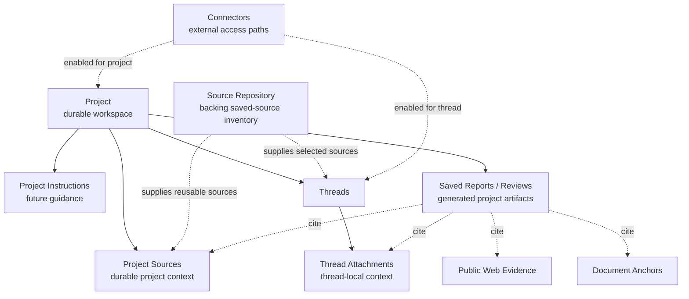

# AG-84A-R0 Project Sources / Source Repository / Saved Reports Decision Record

Status: product architecture decision record / docs-first; no runtime behavior change; no prompt changes; no live validation; no provider/model/search calls; no storage, project UI, source repository, connector, cache, project-instructions, saved-report, or thread-report implementation

## 1. Purpose and scope

AG-84A-R0 finalizes ScryRaven's product vocabulary and object-model decisions before implementation begins. It turns the current local-first research workspace roadmap into a repo-visible decision record so later phases can design and implement project sources, saved source records, saved reports/reviews, project instructions, connector scopes, cache instrumentation, and thread report generation without reopening basic product nouns.

This phase is docs/design only. It does not implement storage, UI, connectors, cache, project instructions, prompt behavior, saved reports, source repository code, source picking, retrieval behavior, document parsing, source-record persistence, or thread report generation.

AG-84A-R0 is intended to guide:

- **AG-84A — Project / Source Repository Architecture Design**;
- **AG-84B — Minimal Project Sources / Saved Source Records Implementation**;
- **AG-86A — Thread Report Generator / Save Thread Synthesis to Project**;
- **AG-82B — Cache Instrumentation and Readiness, no reuse yet**.

If project/source architecture later requires `core/pipeline_orchestrator.py` hooks, AG-84A-R0 only documents a future seam. The orchestrator remains closed in this phase and should continue to be strangled by narrow adapters rather than broadly rewritten.

## 2. Final product vocabulary

### Recommended user-facing terms

| Term | Meaning | Product posture |
| --- | --- | --- |
| **Thread** | A conversation plus thread-local attachments and persistent follow-up context inside that same thread. | Primary unit of conversation and follow-up. |
| **Thread Attachment** | A user-provided file/text/document attached to one thread. | Persistent inside that thread only unless promoted or saved. |
| **Project** | Durable research workspace containing project sources, future project instructions, threads, saved reports/reviews, and scoped connectors. | Main user-facing durable workspace. |
| **Project Source** | Durable source made available to a Project. | Main user-facing durable source concept. |
| **Project Instructions** | Future project-level guidance that can affect threads inside a Project when explicitly implemented. | Deferred protected-surface feature. |
| **Source Repository** | Backing inventory of durable saved sources for reuse, dedupe, versioning, manifests, and source picking. | Infrastructure, not the main user destination. |
| **Connector** | External context access path scoped to a thread or project. | Access path; access does not imply storage. |
| **Saved Report / Review** | Generated artifact saved to a Project, citing back to evidence and anchors. | Project artifact, not primary evidence by default. |
| **Snapshot** | Later explicit capture feature for freezing a state, source set, or report package. | Future feature, not default storage. |

### Recommended internal terms

| Term | Meaning | Notes |
| --- | --- | --- |
| **Corpus** | Internal collection/index boundary used by retrieval, review, or project context systems. | Should remain mostly internal unless a later UI needs it. |
| **SourceRecord** | Durable internal record for a saved source in the Source Repository. | Candidate AG-84A/AG-84B schema concept. |
| **Revision / Manifestation** | Version or extracted/rendered form of a source. | Supports versioning, parser fidelity, and anchor stability. |
| **DocumentReviewContext** | Existing document-review context carrying normalized text, anchors, chunks, metadata, and deterministic review outputs. | Bridges AG-83 document review into future project/source work. |
| **ProjectContext** | Future assembled context for a project-scoped thread. | Should be explicit, reviewable, and bounded. |

### Terms to avoid centering in the UI unless later needed

- **Corpus** — useful internally, but user-facing “corpus” language is less clear than Project Source or Source Repository.
- **Vault** — implies a primary destination, security product, or all-encompassing archive that this phase does not define.
- **Inbox** — implies automatic ingestion and triage that is not implemented.
- **Global Library** — implies whole-account retrieval and broad search that are not default behaviors.
- **Everything search** — conflicts with explicit retrieval scope and source-obligation boundaries.

### Rationale

Project is the durable workspace because it is the product object users can understand, review, organize, export from, and return to. Project Source is the main user-facing durable source concept because it connects a source to an explicit Project and retrieval scope. Source Repository is backing infrastructure for reuse, dedupe, versioning, and source picking; it should not become the primary user destination or an implicit “search everything” surface. Corpus remains mostly internal because it describes retrieval/index boundaries more than user intent. Snapshot is a later explicit capture feature, not default storage created by every attachment, connector access, or report.

## 3. Core product model

ScryRaven's durable workspace is the Project. The Source Repository is backing infrastructure. Thread attachments remain local to a thread unless promoted. Saved reports/reviews live in Projects and cite back to sources.

The core model is:

- **Thread attachments** are persistent inside a thread for follow-up, but are not automatically added to a Project or Source Repository.
- **Projects** are the primary durable user workspace.
- **Project Sources** are the main user-facing durable source context.
- **Source Repository** is backing infrastructure for durable saved sources, reuse, dedupe, versioning, and source picking.
- **Connectors** provide scoped context access; access does not imply storage.
- **Saved Reports / Reviews** are generated project artifacts, not primary evidence.

This model preserves the AG-83 document-local evidence boundary while creating a place for future project-scoped sources and reports. It also preserves the source hierarchy principle that evidence scope is not the same as public truth authority.

## 4. Mermaid diagram

The diagram is intentionally product-level. It does not define tables, APIs, indexes, prompt changes, connector auth, cache keys, or retrieval implementation.

## 5. Thread attachment lifecycle

Thread attachments follow a distinct lifecycle:

1. **Attach to Thread** — the user adds a file, pasted text, Markdown, PDF, DOCX, or other future supported object to a specific Thread.
2. **Retain for follow-up inside that thread** — the attachment remains available to later turns in the same Thread under thread-local persistence rules.
3. **Promote to Project Source** — the user explicitly makes the attachment durable Project Source context for the Project.
4. **Save to Source Repository** — the user explicitly saves a source record for reuse, dedupe, versioning, or later source picking.
5. **Remove from Thread** — the user removes the attachment from that Thread's active context.
6. **Delete attachment** — only if explicitly supported in a later phase with deletion/retention semantics.
7. **Not automatically durable outside the thread** — thread-local persistence is not project persistence and not repository persistence.

Clarifications:

- Thread attachment persistence is thread-local.
- Thread attachments should not silently become Project Sources.
- Thread attachments should not silently become Source Repository records.
- Promotion is a user-visible action with an explicit evidence-scope change.
- Attachment deletion, retention controls, tombstones, and source-record linkage are deferred to AG-84A/AG-84B or later.

## 6. Project lifecycle and contents

A Project may contain:

- project sources;
- project instructions, future feature;
- threads;
- saved reports/reviews;
- exports;
- connector scopes;
- future project-local indexes.

Project lifecycle decisions:

- Threads started inside a Project should inherit Project Sources and Project Instructions when those features are implemented.
- Project context should be explicit and reviewable rather than hidden or global.
- Project is the main user-facing durable research space.
- Project deletion, archival, encryption, tenancy, retention, export packaging, storage location, and storage schema are not implemented in AG-84A-R0.
- Project-local indexes may later support fast retrieval, but AG-84A-R0 does not implement embeddings, indexes, cache reuse, or search behavior.

## 7. Source Repository role

The Source Repository is:

- a backing inventory, not the main user destination;
- the durable source reuse layer;
- a dedupe surface for sources already saved elsewhere;
- a versioning surface for revisions, parser outputs, manifestations, and source-record manifests;
- a source-picking surface for adding saved sources to Projects or Threads;
- a possible future indexing boundary;
- a possible future manifest boundary for `SourceRecord` objects;
- not injected into every answer by default;
- not an “everything search” feature by default.

Repository-source evidence is not automatically active evidence. A source in the Source Repository should become active in a Thread or Project only through explicit selection, promotion, or future retrieval scope rules. Whole-repository retrieval must be explicit rather than the default.

The Source Repository should support Project Sources and Thread Attachments by allowing saved records to be reused, deduped, versioned, picked, and linked. It is infrastructure for reuse and management, not a user promise that every saved source participates in every answer.

## 8. Saved Reports / Reviews

Saved Reports / Reviews are:

- generated project artifacts;
- saved back to a Project;
- allowed to cite thread attachments, project sources, document anchors, public web evidence, and connector-derived evidence if that evidence is explicitly saved/cited under later rules;
- not primary evidence by default;
- not a mechanism for laundering model synthesis into source truth;
- retrievable later as notes or project artifacts only if a future phase defines that behavior.

A saved report/review may summarize, synthesize, critique, or organize evidence. It must preserve the distinction between source claims, document-local claims, corpus/project-local claims, public truth obligations, and model inference.

### Pinned note for AG-86A Thread Report Generator

AG-86A should synthesize a whole thread, thread attachments, project sources, cited web evidence, and document anchors into a durable report saved to the Project.

AG-86A's boundary is that the generated report is not primary evidence by default. It must cite back to thread messages, thread attachments, project sources, web evidence, and document anchors rather than replacing those sources. It belongs after project/source model decisions because it needs a Project destination and stable evidence/source vocabulary before implementation.

AG-84A-R0 does not implement the thread report generator, saved report storage, report retrieval, report UI, prompt behavior, or model-mediated saved report generation.

## 9. Connector scope model

Connectors are access paths. They can be scoped to a Thread or Project, but access does not imply storage.

Connector decisions:

- Connector availability should be explicit and visible.
- Connector content may be used transiently in a Thread or Project when authorized later.
- Connector content should not become a saved source unless explicitly saved.
- Connector-scoped context is not the same as Project Source evidence until saved or promoted.
- Authenticated/private connector ingestion is deferred.
- Connector storage, sync, auth, permissions, retention, indexing, and deletion are not implemented in AG-84A-R0.
- Connector-backed saved sources remain future work.

This boundary prevents connector access from silently changing workspace contents or evidence posture.

## 10. Project Instructions future boundary

Project Instructions are a future project-level guidance feature. When implemented, they would guide Threads inside a Project.

Project Instructions may touch prompts, Author behavior, Controller behavior, retrieval behavior, or other protected behavior surfaces depending on implementation. Because those surfaces are protected, AG-84A-R0 does not authorize prompt changes, Author behavior changes, Controller behavior changes, retrieval behavior changes, provider behavior changes, or AnswerContract runtime changes.

Future Project Instructions work must be explicitly licensed, designed, tested, and reviewed. It must declare which protected surfaces open, what behavior changes are expected, and how prompt/version/retrieval/citation safety will be verified.

## 11. Evidence posture

ScryRaven must distinguish evidence source, evidence scope, and truth obligation.

| Evidence/context type | What it can establish | What it cannot automatically establish |
| --- | --- | --- |
| **Public web evidence** | Publicly sourced claims when the source class matches the claim obligation. | Private workspace truth or claims unsupported by the cited source. |
| **Thread-local attachment evidence** | What the attached document/file/text says inside that Thread. | Project durability, repository membership, or outside-world truth. |
| **Project-source evidence** | What saved Project Sources say and what the Project contains. | Public official/current/legal/academic truth unless the source class satisfies that obligation. |
| **Repository-source evidence** | What a saved SourceRecord contains and can supply when explicitly selected. | Active answer evidence by default or public truth obligations by mere existence. |
| **Connector-provided context** | Transient authorized context available through an access path. | Durable saved evidence unless explicitly saved/promoted. |
| **Document-local evidence** | What a specific document directly states, implies, contradicts, or omits. | Outside-world truth. Document anchors prove what a document says. |
| **Corpus-local evidence** | What a bounded internal corpus/project/library contains. | Public official/current/legal/academic truth by default. |
| **Model inference** | Explicitly labeled reasoning, synthesis, hypotheses, risks, or implications. | Source truth or independently verified facts. |
| **Generated review/report artifacts** | A generated summary, critique, synthesis, or project note with citations. | Primary evidence by default. |

User documents and project/corpus materials are authoritative for what they say or what the user's workspace contains. They do not automatically satisfy public official/current/legal/academic/source-bound obligations. Generated reports/reviews must not launder model synthesis into source truth. Source Repository records do not automatically satisfy public truth obligations. Connector content does not become durable evidence unless saved/promoted under a later implemented action. Document anchors prove what a document says, not outside-world truth.

## 12. Promotion verbs and UI actions

| Verb / action | User meaning | Object changes | Evidence scope change | Must not imply |
| --- | --- | --- | --- | --- |
| **Attach to Thread** | Add material to this conversation. | Creates or links a Thread Attachment. | Available inside that Thread for follow-up. | Not a Project Source; not saved to repository. |
| **Promote to Project Source** | Make thread-local material durable Project context. | Adds/links a Project Source. | Participates in Project context when implemented. | Not public truth; not whole-repository retrieval. |
| **Save to Source Repository** | Save a durable reusable source record. | Creates/updates a SourceRecord or revision. | Available for explicit future source picking. | Not automatically active in every answer. |
| **Save Report to Project** | Preserve generated synthesis/review in the Project. | Adds Saved Report / Review artifact. | Creates project artifact with citations. | Not primary evidence by default. |
| **Enable Connector for Project** | Allow a connector as project-scoped access path. | Adds connector scope/permission metadata when implemented. | Enables authorized project-scoped access. | Not storage or ingestion by itself. |
| **Enable Connector for Thread** | Allow a connector as thread-scoped access path. | Adds connector scope/permission metadata when implemented. | Enables authorized thread-scoped access. | Not Project Source creation by itself. |
| **Create Snapshot** | Explicitly capture a state/source set/report package. | Creates future snapshot object. | Freezes a defined capture boundary. | Not default behavior for every action. |
| **Remove from Project** | Stop using a source/artifact/scope in a Project. | Removes Project linkage or project visibility. | No longer active project context when implemented. | Not necessarily repository deletion. |
| **Remove from Thread** | Stop using an attachment/scope in a Thread. | Removes Thread linkage or active attachment state. | No longer active thread-local context. | Not necessarily project/repository deletion. |
| **Delete Source** | Delete a saved source under future retention rules. | Deletes/tombstones a SourceRecord or source object if supported. | Removes durable saved source availability. | Not defined until retention/deletion semantics exist. |

## 13. Retrieval scope defaults

Retrieval scope should be explicit and bounded:

- Default retrieval should use current Thread context and current Project context once implemented.
- Thread attachments should participate in the Thread they belong to.
- Project Sources should participate in Threads inside the Project when implemented.
- Whole Source Repository retrieval should be explicit.
- Connector use should be explicit and scoped.
- Source Repository records should not be injected into every answer by default.
- Generated reports should not be treated as primary evidence unless a future phase defines note/report retrieval behavior.
- Public web evidence obligations remain governed by claim-sensitive source hierarchy, not by the existence of local documents or generated reports.

AG-84A-R0 does not implement retrieval ranking, filtering, query generation, provider/search behavior, citation behavior, source ordering, cache reuse, or final evidence selection.

## 14. Storage and persistence non-goals

AG-84A-R0 must not implement storage. The following are non-goals:

- project DB schema;
- source repository schema;
- source record persistence;
- project-source persistence;
- embeddings/indexes;
- cache reuse;
- connector storage;
- snapshots;
- project instructions;
- thread report generator;
- project UI;
- deletion/retention controls;
- import/export pipelines.

If this decision record exposes unresolved storage questions, those questions belong to AG-84A or AG-84B design work rather than schema/code in AG-84A-R0.

## 15. Follow-on phase roadmap

| Phase | Scope | Non-goals | Likely touched surfaces | Stop conditions | Protected surfaces closed unless explicitly licensed |
| --- | --- | --- | --- | --- | --- |
| **AG-84A — Project / Source Repository Architecture Design** | Design project/source object model, storage options, source-record manifests, lifecycle states, source picking, retention questions, and future seams. | Runtime implementation, prompt changes, connector implementation, cache reuse, report generation. | Product/architecture docs; possible schema proposals only. | Stop if storage/privacy/deletion choices cannot be resolved at design level. | Prompts, runtime retrieval, providers, Author/Controller behavior, DB migrations, orchestrator rewrite. |
| **AG-84B — Minimal Project Sources / Saved Source Records Implementation** | Implement the smallest explicitly approved project-source/source-record slice after AG-84A. | Whole repository retrieval, connectors, snapshots, project instructions, report generator, broad UI. | Storage layer, local metadata, tests, maybe narrow adapters. | Stop if implementation requires protected runtime behavior not licensed. | Prompts, provider/search behavior, citation behavior, cache reuse, broad orchestrator work unless separately scoped. |
| **AG-86A — Thread Report Generator / Save Thread Synthesis to Project** | Generate a durable thread synthesis saved to a Project with citations back to thread messages, attachments, Project Sources, web evidence, and anchors. | Treating reports as primary evidence, hidden retrieval of reports, connector ingestion, project/source storage redesign. | Report artifact model, export/save flow, citation/provenance contract, tests. | Stop if citation duty or project destination is unstable. | Prompt/model behavior unless explicitly licensed; retrieval ranking/filtering; final evidence selection. |
| **AG-82B — Cache Instrumentation and Readiness, no reuse yet** | Measure repeated work, cache-key candidates, privacy scopes, and reuse readiness without changing behavior. | Runtime cache reuse, prompt caching, provider-result reuse, corpus-level reuse. | Telemetry/instrumentation docs/tests; possibly redacted aggregate metrics. | Stop if instrumentation would expose secrets/private docs/raw payloads or alter behavior. | Cache behavior/cache keys used for runtime decisions, providers, prompts, retrieval, citations, DB shape unless licensed. |
| **Later snapshots** | Explicit capture of a project state, source set, report package, or evidence bundle. | Default capture for every action. | Product/storage/export design. | Stop if retention/deletion semantics are undefined. | Retrieval/citation behavior unless licensed. |
| **Later connector-backed saved sources** | Save authorized connector content as Project Sources or SourceRecords. | Silent ingestion or broad sync. | Connector auth/sync/storage/permissions design. | Stop if auth, retention, or user-visible consent is unresolved. | Connector implementation remains closed until explicitly licensed. |
| **Later Project Instructions** | Add project-level guidance for threads. | Unreviewed prompt or behavior changes. | Prompt/version policy, Controller/Author/retrieval contracts, tests. | Stop if protected surfaces are not explicitly opened. | Prompts, Author behavior, Controller behavior, retrieval behavior by default. |
| **Later model-mediated saved report generation** | Use model calls to generate saved reports once licensed. | Live validation or provider calls in docs-only phases. | Report generator, provenance, prompt contract, tests. | Stop if source/citation duty is not enforceable. | Model/provider/prompt behavior unless licensed. |

## 16. Explicit non-goals

AG-84A-R0 keeps the following surfaces closed:

- prompts;
- model calls;
- Author behavior;
- provider/search/retrieval behavior;
- provider routing/depth/selection/swaps/new providers;
- query generation/finalization/recency/official-bias/query ordering;
- retrieval ranking/filtering;
- final evidence selection;
- citation behavior/source ordering;
- Analyst/Economist/Scrutineer/synthesis-evaluator behavior;
- Controller/AnswerContract runtime behavior;
- DB/session/RunOutcome runtime shape;
- project/source storage implementation;
- connector implementation;
- cache behavior/cache keys/runtime cache reuse;
- personal corpus/library implementation;
- project instructions implementation;
- thread report generator implementation;
- package/CLI/env compatibility rename;
- live validation;
- hosted deployment;
- broad `core/pipeline_orchestrator.py` rewrite.

No phase should treat this decision record as authorization to change those surfaces. Future phases must explicitly license and test any protected surface they open.
